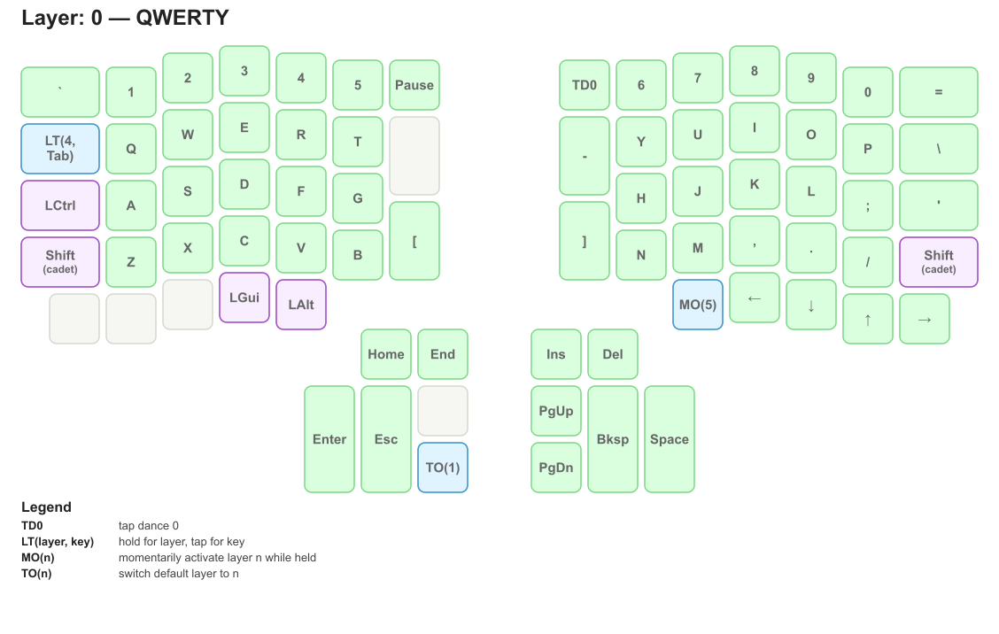
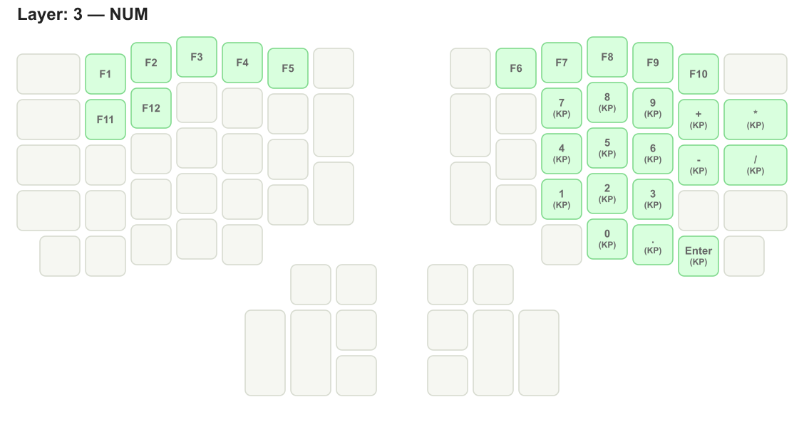

# kbviz

Small Python tool for visualizing QMK keyboard layers as SVG or PNG images.

The goal is practical layout documentation and review, especially for answering:

> What changed on this layer?

Current scope:

- ErgoDox EZ via `LAYOUT_ergodox_pretty`
- Moonlander via `LAYOUT_moonlander`
- one image per layer
- inherited keys shown in light gray
- overridden keys highlighted and labeled

This is intentionally not a framework.

## Quick start

Render the included ErgoDox input directory:

```bash
python3 kbviz.py inputs/ergodox -o out-ergo
```

Render the included Moonlander input directory:

```bash
python3 kbviz.py inputs/moonlander -o out-moon
```

## Inputs

`kbviz.py` accepts three input forms:

- bare `keymap.c`
- a directory containing `keymap.c`
- a ZSA source zip containing `keymap.c`

Examples:

```bash
python3 kbviz.py path/to/keymap.c -o out
python3 kbviz.py path/to/layout-dir -o out
python3 kbviz.py path/to/source.zip -o out
```

When using a directory or zip, layer names can be provided via sidecar files:

- `layer-names.txt`
- `layer_names.json`

A bare `keymap.c` can also use an adjacent sidecar file with either of those names.

Example `layer-names.txt`:

```txt
0 QWERTY
1 Dvorak
2 Gaming
3 NUM
4 NAV
5 KBD
```

If no sidecar layer-name file is found:

- image titles stay as `Layer: N`
- filenames fall back to `layerN.svg` / `layerN.png`

Included in this repo:

- `inputs/ergodox/`
- `inputs/moonlander/`

## Output formats

Flags:

- `--png` generates PNG
- `--svg` generates SVG
- more than one flag may be specified
- if no format flag is given, output defaults to SVG

Examples:

```bash
python3 kbviz.py inputs/ergodox -o out
python3 kbviz.py inputs/ergodox -o out --png
python3 kbviz.py inputs/ergodox -o out --svg --png
```

Optional styling:

- `--colorful` uses subtle category colors for overridden keys

Example:

```bash
python3 kbviz.py inputs/ergodox -o out-ergo-color --colorful
```

Example output files:

- with layer names: `out/00-QWERTY.svg`
- without layer names: `out/layer0.svg`

## Labeling

Labels are normalized for readability.

Examples:

- navigation keys become short labels such as `PgUp`, `PgDn`, `Home`, `End`
- arrow keys use arrows: `←`, `→`, `↑`, `↓`
- keypad digits/operators are compacted, for example `7` with `(KP)` on a second line
- long special labels may be split across two lines when needed

Layer operations remain explicit so they can still be translated back into QMK/Oryx directly:

- `MO(3)`
- `OSL(4)`
- `TO(1)`
- `LT(3, KC_TAB)`

Unknown or custom expressions fall back to the original token.

## Example output

Base layer (full map):



Partial override layer:



## Notes

- Geometry is based on QMK layout data and is intended to be visually accurate.
- Readability is prioritized over exact board dimensions.
- Supported input forms are: directory, bare `keymap.c`, or ZSA source zip.
- PNG export uses `inkscape`.
- Without `--colorful`, overridden keys use a single green tint.
- With `--colorful`, overridden keys get subtle category tints, including distinct colors for layer-operation keys and modifier keys.
- Each image may include a Legend section for special constructs; it is generated per layer and only lists the special codes used on that image.
- The parser is intentionally narrow and expects standard QMK layer entries such as:

```c
[QWERTY] = LAYOUT_ergodox_pretty(...)
```

or:

```c
[0] = LAYOUT_moonlander(...)
```

## Viewing output

Any app or browser that can display SVG or PNG files should work.

Examples:

```bash
open out/00-QWERTY.svg
open out/00-QWERTY.png
```

This repo also includes a small helper for opening all SVGs in a browser on macOS:

```bash
./view-svgs.sh out
```

Or with an explicit app:

```bash
SVG_APP=Firefox ./view-svgs.sh out
```
